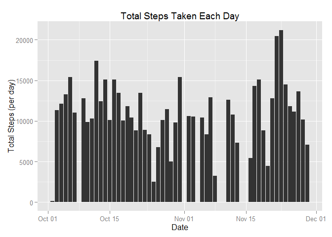
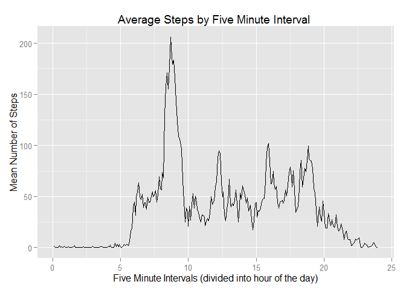
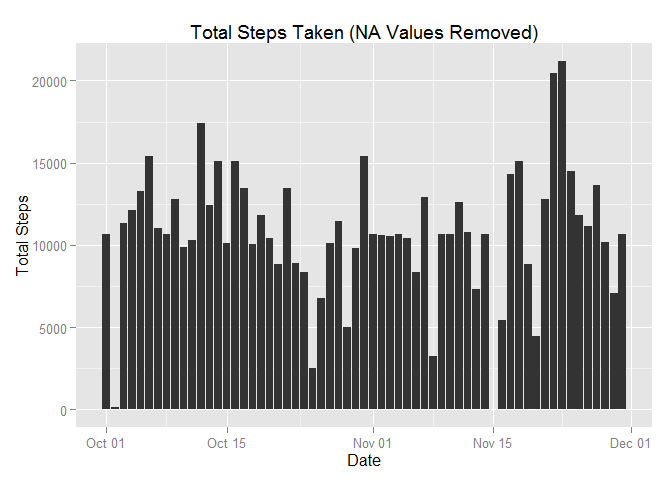
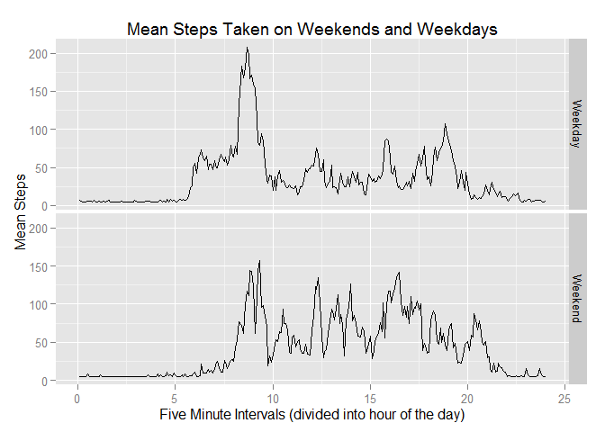

# Reproducible Research: Peer Assessment 1


## Loading and preprocessing the data


```r
library(ggplot2)
library(dplyr)
library(lubridate)
library(tidyr)
```


```r
# read in data. 
activityData <- read.csv("activity.csv", 
                         header = TRUE, 
                         stringsAsFactors = FALSE)

# convert date column to POSIXct
activityData$date <- ymd(activityData$date)

# create an index column for intervals (1 - 288 per day). This is the least fussy way I discovered to allow for continuous graphing without R focing lines between gaps from 55s and 1m
activityData$intNum <- 1:(24*60/5)

# filter out rows with NA values in steps
activityFilt <- activityData %>%
  filter(!is.na (steps))
```


## What is mean total number of steps taken per day?

1. Calculate the total number of steps taken per day. 

```r
totalActivity <- activityFilt %>%
  select(steps, date) %>%
  group_by(date) %>%
  summarize(totalSteps = sum(steps))

head(totalActivity)
```

```
## Source: local data frame [6 x 2]
## 
##         date totalSteps
## 1 2012-10-02        126
## 2 2012-10-03      11352
## 3 2012-10-04      12116
## 4 2012-10-05      13294
## 5 2012-10-06      15420
## 6 2012-10-07      11015
```

2. Make a histogram of the total number of steps taken each day.


```r
g <- ggplot(totalActivity, aes(date, totalSteps))

g <- g + geom_histogram(stat = "identity") + 
  ggtitle("Total Steps Taken Each Day") +
  xlab("Date") + 
  ylab("Total Steps (per day)")

g
```

 

3. Calculate and report the mean and median of the total number of steps taken per day.


```r
# mean activity
meanActivity <- totalActivity %>%
  summarize(meanSteps = mean(totalSteps))

# median activity
medianActivity <- totalActivity %>%
  summarize(meanSteps = median(totalSteps))

meanActivity 
```

```
## Source: local data frame [1 x 1]
## 
##   meanSteps
## 1  10766.19
```

```r
medianActivity
```

```
## Source: local data frame [1 x 1]
## 
##   meanSteps
## 1     10765
```


## What is the average daily activity pattern?

1. Make a time series plot (i.e. type = "l") of the 5-minute interval (x-axis) and the average number of steps taken, averaged across all days (y-axis)


```r
# group by interval index (1-288)and find the average steps for that interval over all included days. 
meanSteps <- activityFilt %>%
  group_by(intNum) %>%
  mutate(meanSteps = mean(steps))

# multiply the five minute index interval (1-288) by five to correspond with five minute interval, then divide by sixty to convert to hours for a nice x axis timeline.
g <- ggplot(meanSteps, aes(x = intNum*5/60, y = meanSteps))

g + geom_line() + 
  ggtitle("Average Steps by Five Minute Interval ") + 
  xlab("Five Minute Intervals (divided into hour of the day)") + 
  ylab("Mean Number of Steps")
```

 

2. Which 5-minute interval, on average across all the days in the dataset, contains the maximum number of steps?


```r
# use whichmax to find interval has the highest mean steps
meanSteps[[which.max(meanSteps$meanSteps), "interval"]]
```

```
## [1] 835
```


## Inputing missing values

1. Calculate and report the total number of missing values in the dataset (i.e. the total number of rows with NAs)


```r
length(is.na(activityData$steps))
```

```
## [1] 17568
```

2. Devise a strategy for filling in all of the missing values in the dataset. The strategy does not need to be sophisticated. For example, you could use the mean/median for that day, or the mean for that 5-minute interval, etc.


```r
# set NAs equal to mean of steps on that day. 

activityDataComplete <- activityData %>%
  group_by(date) %>%
  transform(steps = ifelse(is.na(steps), 
                           as.integer(mean(steps, na.rm = TRUE)),
                           steps))
```


3. Create a new dataset that is equal to the original dataset but with the missing data filled in.

- See number 2 above.

4. Make a histogram of the total number of steps taken each day and Calculate and report the mean and median total number of steps taken per day. Do these values differ from the estimates from the first part of the assignment? What is the impact of imputing missing data on the estimates of the total daily number of steps?


```r
totalActivityComplete <- activityDataComplete %>%
  select(steps, date) %>%
  group_by(date) %>%
  summarize(totalSteps = sum(steps))

g <- ggplot(totalActivityComplete, aes(date, totalSteps))
g + geom_histogram(stat = "identity") +
  ggtitle("Total Steps Taken (NA Values Removed)") +
  xlab("Date") +
  ylab("Total Steps")
```

 

```r
meanActivityNoNA <- totalActivityComplete %>%
  summarize(meanStepsnoNA = mean(totalSteps))

medianActivitynoNA <- totalActivityComplete %>%
  summarize(medianStepsnoNA = median(totalSteps))

combined <- cbind(meanActivity, 
                  medianActivity, 
                  meanActivityNoNA, 
                  medianActivitynoNA)

combined
```

```
##   meanSteps meanSteps meanStepsnoNA medianStepsnoNA
## 1  10766.19     10765      10751.74           10656
```

Overall, substituting NA values for the mean step value which occurred on that given day had only a slight effect on the mean and median step values. The replacement of NA values in this way produced an almost indiscernable change in the mean value, and resulted in a decrease of 100 in the median value. 


## Are there differences in activity patterns between weekdays and weekends?

1. Create a new factor variable in the dataset with two levels - "weekday" and "weekend" indicating whether a given date is a weekday or weekend day.


```r
# create a weekday factor variable. convert dates to weekdays, if the name is now "Saturday" or "Sunday", label as "Weekend", otherwise, "Weekday"
activityDataComplete$weekday <- as.factor(ifelse(weekdays(activityDataComplete$date) %in% c("Saturday","Sunday"), "Weekend", "Weekday")) 
```


2. Make a panel plot containing a time series plot (i.e. type = "l") of the 5-minute interval (x-axis) and the average number of steps taken, averaged across all weekday days or weekend days (y-axis). See the README file in the GitHub repository to see an example of what this plot should look like using simulated data.


```r
# group data by the interval index, then by weekday/weekend. take the mean of that interval index (in the weekday/weekend groups)
activityDataComplete <- activityDataComplete %>% 
  group_by(intNum, weekday) %>%
  mutate(meanSteps = mean(steps))

#create plot
g <- ggplot(activityDataComplete, aes(x = intNum*5/60, y = meanSteps))
g <- g + geom_line() + xlab("Hour of the day") + 
  ggtitle("Mean Steps Taken on Weekends and Weekdays") +
  xlab("Five Minute Intervals (divided into hour of the day)") + 
  ylab("Mean Steps")

g + facet_grid(weekday ~ .)
```

 

